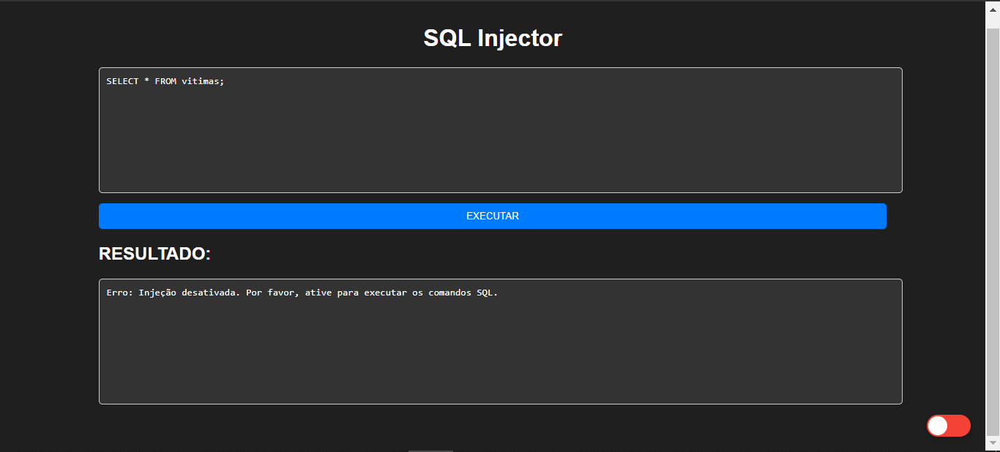
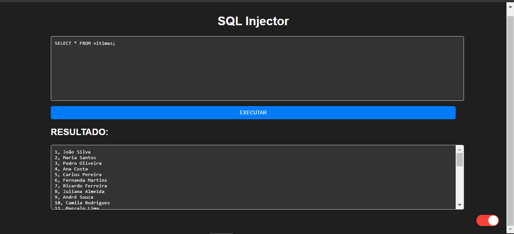

# SQL INJECTOR
👨‍🏫EXECUTE COMANDOS SQL INJECTOR EM UM AMBIENTE CONTROLADO (PARA FINS EDUCACIONAIS).

 <br>
 <br>

## DESCRIÇÃO:
Este aplicativo é um SQL Injector, desenvolvido em PHP, HTML, CSS e JavaScript. Ele permite que os usuários executem comandos SQL em um banco de dados PostgreSQL a partir de um formulário web. Ele é útil para estudantes e desenvolvedores que desejam aprender sobre injeção SQL e práticas seguras de desenvolvimento web. O mesmo fornece uma maneira prática de experimentar comandos SQL em um ambiente controlado e entender melhor os riscos associados à injeção SQL.

## RECURSOS:
1. **Interface do Usuário:**
   - A interface do usuário é composta por um formulário onde os usuários podem inserir comandos SQL.
   - Há também um botão "EXECUTAR" que os usuários podem clicar para enviar os comandos SQL para serem executados.
   - Um botão de alternância permite que os usuários ativem ou desativem a injeção de comandos SQL. Esse tipo de botão é comumente conhecido como "Toggle Floating Action Button" (Botão de Ação Flutuante de Alternância) ou simplesmente "Toggle FAB". Ele é chamado assim porque permite alternar entre dois estados, semelhante a uma alavanca de ligar/desligar.

2. **Funcionalidades:**
   - Quando um usuário insere comandos SQL no formulário e clica em "EXECUTAR", os comandos são enviados para o servidor para processamento.
   - Se a injeção estiver ativada (indicada pelo botão de alternância), os comandos SQL são executados no banco de dados PostgreSQL.
   - O resultado da execução dos comandos SQL é exibido na área de resultado, abaixo do formulário.
   - Se a injeção estiver desativada, o aplicativo exibirá uma mensagem de erro indicando que a injeção está desativada.

3. **Tecnologias Utilizadas:**
   - **PHP:** O backend do aplicativo é desenvolvido em PHP, que é responsável por receber os comandos SQL, executá-los e retornar os resultados.
   - **HTML/CSS:** A estrutura e o estilo da página web são criados com HTML e CSS para criar uma interface amigável e responsiva.
   - **JavaScript/jQuery:** O JavaScript e a biblioteca jQuery são utilizados para controlar a interatividade do usuário, como a submissão do formulário e a ativação/desativação da injeção SQL.

4. **Segurança:**
   - O aplicativo inclui medidas básicas de segurança para proteger contra injeção SQL. Por exemplo, ele permite que os usuários ativem ou desativem a injeção SQL, evitando assim execuções não autorizadas de comandos SQL.
   - No entanto, é importante observar que este aplicativo é apenas para fins educacionais e não deve ser utilizado em ambientes de produção sem medidas adicionais de segurança.

## EXECUTANDO O PROJETO:
1. **Configuração do Banco de Dados:**
   - Antes de executar o site, é necessário importar o arquivo `DATABASE.sql`. Se não estiver familiarizado com o processo de importação, [confira este curso](https://github.com/VILHALVA/CURSO-DE-POSTGRESQL) para orientações detalhadas.

2. **Configuração do PHP:**
   - Abra o arquivo `CODIGO.php` e ajuste as configurações do banco de dados:

     ```php
     $servidor = "localhost";
     $username = "seu_usuario";
     $usersenha = "sua_senha";
     $database = "injector";
     ```

3. **Executando o Aplicativo:**
   - Coloque os arquivos em um servidor web compatível com PHP (por exemplo, XAMPP, WAMP, LAMP).
   - Acesse o formulário no navegador visitando `http://localhost/CODIGO/index.html`.

4. **Digite os Comandos SQL:**
   - No campo de texto do formulário, digite os comandos SQL que deseja executar no banco de dados.

5. **Ative a Injeção (Opcional):**
   - Se desejar permitir a execução dos comandos SQL, clique no botão de alternância para ativá-lo. Isso indicará que a injeção SQL está habilitada.

6. **Execute os Comandos SQL:**
   - Depois de inserir os comandos SQL desejados, clique no botão "EXECUTAR" para enviar os comandos para processamento.

7. **Veja os Resultados:**
   - Os resultados da execução dos comandos SQL serão exibidos na área de resultado abaixo do formulário.

## EXEMPLOS DE COMANDOS:
Aqui estão alguns exemplos de comandos SQL que você pode experimentar no aplicativo:

1. **Selecionar Todos os Registros de uma Tabela:**
   ```sql
   SELECT * FROM public.vitimas;
   ```

2. **Selecionar Registros Específicos de uma Tabela:**
   ```sql
   SELECT nome FROM public.vitimas WHERE id = 1;
   ```

3. **Inserir um Novo Registro em uma Tabela:**
   ```sql
   INSERT INTO public.vitimas (nome) VALUES ('Novo Usuário');
   ```

4. **Atualizar um Registro em uma Tabela:**
   ```sql
   UPDATE public.vitimas SET nome = 'Novo Nome' WHERE id = 1;
   ```

5. **Excluir um Registro de uma Tabela:**
   ```sql
   DELETE FROM public.vitimas WHERE id = 1;
   ```

## NÃO SABE?
- Entendemos que para manipular arquivos em `HTML`, `CSS` e outras linguagens relacionadas, é necessário possuir conhecimento nessas áreas. Para auxiliar nesse aprendizado, oferecemos cursos gratuitos disponíveis:
* [CURSO DE HTML E CSS](https://github.com/VILHALVA/CURSO-DE-HTML-E-CSS)
* [CURSO DE JAVASCRIPT](https://github.com/VILHALVA/CURSO-DE-JAVASCRIPT)
* [CURSO DE PHP](https://github.com/VILHALVA/CURSO-DE-PHP)
* [VEJA MAIS EXEMPLOS DE COMANDOS NO CURSO DE POSTGRESQL](https://github.com/VILHALVA/CURSO-DE-POSTGRESQL)
* [CONFIRA MAIS CURSOS](https://github.com/VILHALVA?tab=repositories&q=+topic:CURSO)

## SUBSÍDIOS:
- [MINICURSO CRIADO PELO VILHALVA](https://github.com/VILHALVA)
- [CLIQUE AQUI PARA ACESSAR AO MINICURSO](./MINICURSO.md)


